# 8INF804 - Projet de session

## Introduction

L'accessibilité est une priorité croissante dans le développement technologique, visant à créer des outils qui améliorent la vie des personnes en situation de handicap. Le premier TP s'inscrivait dans ce cadre, et a motivé le choix de ce sujet pour ce projet, dans un contexte différent, celui de la langue des signes, utilisée par les malentendants pour communiquer. Notre objectif est donc ici de développer un *Proof of Concept* de la faisabilité d'une application de reconnaissance de la langue des signes en temps réel, basée sur des modèles de détection d'objets.

Cette application repose sur un modèle YOLO (You Only Look Once), entraîné spécifiquement sur un *dataset* de lettres et de chiffres en langue des signes. Grâce à ce modèle de détection d'objets, notre solution est capable de déchiffrer des signes en temps réel via des flux vidéo de *webcam* ou des vidéos préenregistrées. YOLO, en raison de sa rapidité et de son efficacité pour détecter et classer des objets, est parfaitement adapté pour une reconnaissance en temps réel, essentielle pour interpréter les signes de manière fluide et précise.

L'objectif principal de cette application est de démontrer la faisabilité de l'accessibilité et l'aide aux personnes malentendantes pour communiquer plus facilement avec leur entourage, en particulier dans des situations où un traducteur de langue des signes n'est pas disponible. Le *scope* de cette application s'inscrit dans le cadre d'un démonstrateur sur des signes simples (lettres et chiffres), en ignorant l'ensemble du dictionnaire de langue des signes, pour permettre au projet de conserver la dimension d'un projet de fin de session. 

## Implémentation

### Modèle

Le modèle YOLOv11 a été choisi pour sa rapidité et son efficacité. Il est capable de détecter et de classer des objets en temps réel, ce qui est essentiel pour notre application. Nous avons entraîné ce modèle sur un *dataset* de lettres et de chiffres en langue des signes, pour qu'il soit capable de reconnaître ces signes en temps réel.

### *Dataset*

> TODO : Le dataset envoyé sur whatsapp ne comporte que des lettres, je laisse ça vide pour l'instant, à compléter

YOLO nécessite, pour son entraînement, que les objets à détecter soient idéalement entourés de *bounding boxes*, ou à défauts situés au centre de l'image. Nous avons donc choisi trois datasets :

- [Sign Language Dataset for YOLOv7 - Kaggle](https://www.kaggle.com/datasets/daskoushik/sign-language-dataset-for-yolov7) : Premier dataset utilisé, initialement peu fonctionnel, à cause du faible nombre d'images contenues dedans. Finalement gardé dans le mix des datasets, à cause de la diversité de ses images et de fonds de celles-ci.
- [American Sign Language - Kaggle](https://www.kaggle.com/datasets/kapillondhe/american-sign-language) : Le plus important, mais utilisabilité réduite à cause de la répétition des mêmes signes et des mêmes fonds, qui a fini par causer de l'*overfitting*, résolu plus bas.
- [ASLYset - Mendeley](https://data.mendeley.com/datasets/xs6mvhx6rh/1) : De bonne qualité et variété.

### Méthodologie

> TODO : Méthodologie de l'entraînement du modèle, à compléter

### Utilisation des flux vidéos enregistrés et de la webcam

### Difficultés rencontrées

Alors que nous pensions initialement que la détection se ferait facilement, nous avons rapidement été confrontés aux limites de nos premiers modèles. L'entraînement de YOLO se passait rapidement et facilement, mais le taux de détection en confrontant le modèle à des flux vidéos était très faible.

Après quelques recherches pour comparer à des projets existants, nous avons observé que les projets existants s'essayant au même objectif se bornaient souvent à la détection efficace de quelques lettres, et rencontraient surtout les mêmes problèmes que nous.

En comparant ces informations avec des tests locaux, nous en avons conclus que le problème venait donc du dataset, sur lequel le modèle faisait de l'*over-fitting*, et pas du modèle en lui-même. Pour résoudre cette problématique, nous avons pris deux décisions :

1. Augmenter le taille du dataset
2. Augmenter les images du dataset

#### Augmenter le taille du dataset

Nous avons recherché des datasets supplémentaires pour augmenter notre base d'apprentissage, de caractéristiques différentes, comme des fonds de différentes couleurs. Le script `script_dataset_yolo_2.py` permet de fusionner un ensemble de datasets en un seul, pour entraîner le modèle sur un plus grand nombre d'images. 

Ceci a effectivement permis d'améliorer les performances du modèle, mais pas suffisamment pour obtenir des résultats satisfaisants. Nous avons donc décidé de passer à l'étape suivante.

#### Augmenter les images du dataset 

Pour améliorer encore les performances du modèle, nous avons rédigé un script de *data augmentation*, pour ajouter du bruit et des changements entre les différentes images du dataset. 

Ce script paramétrable, disponible dans le dossier `image_augmentation/`, applique un ensemble de modification aux images, de manière probabilistique, pour que chaque image soit modifiée de manière différente. Les modifications possibles sont :

- Découpage aléatoire de l'image
- Retournement horizontal
- Changement de luminosité et de contraste
- Application de CLAHE
- Redimensionnement
- Changement de teinte, saturation et valeur
- Flou gaussien
- Déplacement, rotation et mise à l'échelle
- *Coarse dropout*
- Normalisation

Ce script a été rédigé avec la librairie python `albumentations`, qui permet de réaliser des transformations d'images de manière simple et efficace. La partie la plus complexe de cette étape a été d'arriver à conserver les informations de labels pendant les transformations du type rotation ou découpage, pour que les *bounding boxes* soient correctement ajustées.

### Autres choix de conception

> TODO : Si y a d'autres choses à dire

## Utilisation

```mermaid
sequenceDiagram
    participant U as Utilisateur
    participant DA as DatasetsAggregator
    participant IA as ImageAugmentation
    participant W as Webcam
    participant MY as ModèleYOLO

    rect rgb(0, 0, 50)
    note right of U: Préparer les datasets
    U->>+DA: Fusionner les datasets
    DA->>-U: Dataset fusionné
    U->>+IA: Augmenter les images du dataset
    IA->>-U: Dataset augmenté
    U->>+MY: Entraîner le modèle
    MY->>-U: Modèle entraîné
    end

    rect rgb(50, 0, 00)
    note right of U: Utiliser l'application
    U->>+W: Démarrer la capture vidéo
    W->>-MY: Envoyer flux vidéo
    MY->>U: Afficher les résultats
    end
```

<!--Voir https://mermaid.js.org/syntax/sequenceDiagram.html--> 

## Résultats

Nous avons réalisé nos tests utilisant deux types de flux vidéos :

- Un flux vidéo enregistré, à partir de la vidéo Youtube [Train YOLOv8 on Custom Dataset | Sign Language Alphabets Detection and Recognition using YOLOv8](https://www.youtube.com/watch?v=-UoSr9Z_Bg0)
- Un flux vidéo en direct, à partir de la *webcam* de l'ordinateur

> TODO : Résultats de l'entraînement du modèle, à compléter

## Conclusion

> TODO : Conclusion si tout se passe bien, à modifier sinon

Dans ce projet nous avons réussis à mettre en place un modèle de détection d'objets capable de reconnaître des signes en
langue des signes américaine en temps réel. Nous avons entraîné ce modèle sur un *dataset* de lettres en langue des signes,
et avons obtenu des résultats satisfaisants. Notre application est capable de détecter et de classer des signes en temps 
réel, et peut être utilisée via une *webcam* ou sur des vidéos préenregistrées.

Ce projet nous a montré l'importance du *dataset* dans la qualité des résultats d'un modèle de détection d'objets. Nous 
avons rencontré des difficultés, qui se sont avérées être liées à la qualité et la diversité de notre dataset. Nous avons
dû augmenter sa taille et ses images (manipulations sur les images) pour obtenir des résultats satisfaisants, en conservant 
les informations de *bounding boxes*.

Cette application avait une visée de démonstrateur, et se borne donc à reconnaître des lettres. Dans un contexte réel, 
les mains sont constamment en mouvement, une première piste d'amélioration que nous pourrions explorer serait de trouver 
un moyen de détecter les lettres qui nécessitent un mouvement comme le "J" ou le "Z". De plus, une discussion en langue 
des signes implique de signer de nombreux mots, à peu près autant qu'en langue vocale, et nécessiterait un modèle beaucoup 
plus complexe, capable de reconnaître un grand nombre de signes différents, avec un temps d'entraînement d'autant 
conséquent. Ce serait une autre piste d'amélioration découlant de la première, qui serait possible en étendant le 
*dataset* et en entraînant le modèle sur un plus grand nombre de signes.

## Références

Nous avons regardé de nombreux projets existants pour nous inspirer et comprendre les difficultés que nous allions rencontrer. Voici quelques-uns des projets que nous avons consultés.

Avec RetinaNet, que nous avons fini par ne pas utiliser :

- [Video Object Detection with RetinaNet](https://freedium.cfd/https://medium.com/@findalexli/object-detection-object-detection-is-an-important-task-in-the-field-of-computer-vision-research-63fdcc006fb1)
- [`nwojke / deep_sort`](https://github.com/nwojke/deep_sort)
- [Object-Detection: Advanced Object Detection with RetinaNet](https://medium.com/@vipas.ai/object-detection-advanced-object-detection-with-retinanet-a326c92a2e34)
- [`jaspereb / Retinanet-Tutorial`](https://github.com/jaspereb/Retinanet-Tutorial)

Avec YOLO, que nous avons finalement utilisé :

- [`MuhammadMoinFaisal / Sign-Language-Alphabets-Detection-and-Recongition-using-YOLOv8`](https://github.com/MuhammadMoinFaisal/Sign-Language-Alphabets-Detection-and-Recongition-using-YOLOv8?tab=readme-ov-file)
- [`mukund0502 / sign_recognition_yolo-v8`](https://github.com/mukund0502/sign_recognition_yolo-v8/tree/main)
- [`paulinamoskwa / Real-Time-Sign-Language`](https://github.com/paulinamoskwa/Real-Time-Sign-Language?tab=readme-ov-file)
