# 8INF804 - Projet de session

## Introduction

L'accessibilité est une priorité croissante dans le développement technologique, visant à créer des outils qui améliorent la vie des personnes en situation de handicap. Le premier TP s'inscrivait dans ce cadre, et a motivé le choix de ce sujet pour ce projet, dans un contexte différent, celui de la langue des signes, utilisée par les malentendants pour communiquer. Notre objectif est donc ici de développer un *Proof of Concept* de la faisabilité d'une application de reconnaissance de la langue des signes en temps réel, basée sur des modèles de détection d'objets.

Cette application repose sur un modèle YOLO (You Only Look Once), entraîné spécifiquement sur un *dataset* de lettres en langue des signes. Grâce à ce modèle de détection d'objets, notre solution est capable de déchiffrer des signes en temps réel via des flux vidéo de *webcam* ou des vidéos préenregistrées. YOLO, en raison de sa rapidité et de son efficacité pour détecter et classer des objets, est parfaitement adapté pour une reconnaissance en temps réel, essentielle pour interpréter les signes de manière fluide et précise.

L'objectif principal de cette application est de démontrer la faisabilité de l'accessibilité et l'aide aux personnes malentendantes pour communiquer plus facilement avec leur entourage, en particulier dans des situations où un traducteur de langue des signes n'est pas disponible. Le *scope* de cette application s'inscrit dans le cadre d'un démonstrateur sur des signes simples (lettres), en ignorant l'ensemble du dictionnaire de langue des signes, pour permettre au projet de conserver la dimension d'un projet de fin de session.

Pour ce projet nous souhaitons dans un premier temps proposer une détection de lettres en langue des signes. Nous avons choisi de nous concentrer sur les lettres de l'alphabet américain, il s'agit du langage le plus utilisé dans le monde.

**Le code source de ce projet est disponible sur [Github](https://github.com/eltar14/projet-VA).**

\pagebreak

## Implémentation

### Modèle

Le modèle YOLOv11 a été choisi pour sa rapidité et son efficacité. Il est capable de détecter et de classer des objets en temps réel, ce qui est essentiel pour notre application. Nous avons entraîné ce modèle sur un *dataset* de lettres et de chiffres en langue des signes, pour qu'il soit capable de reconnaître ces signes en temps réel.

### *Dataset*

YOLO nécessite, pour son entraînement, que les objets à détecter soient idéalement entourés de *bounding boxes*, ou qu'ils constituent toute l'image (pas d'autres éléments à côté ou derrière).   

Nous avons cherché des datasets depuis différentes sources : Kaggle, Roboflow, Hugging Face... Mais trouver un bon dataset est plutôt compliqué. Ils sont soit très petits (<1000 images en tout, donc une trentaines d'images par lettres), soit peu d'images mais copiées-collées pour donner l'impression d'avoir un set plus conséquent. 
Cela nous a conduits à en chercher sur d'autres plateformes, mais les résultats étaient limités en raison de l'arborescence spécifique des fichiers en entrée de YOLO, décrite dans la partie méthodologie.  


Nous avons donc progressivement choisi trois datasets puis les avons fait correspondre à nos critères (explications détaillées dans la partie *Difficultés rencontrées*) :

- [Sign Language Dataset for YOLOv7 - Kaggle](https://www.kaggle.com/datasets/daskoushik/sign-language-dataset-for-yolov7) : Premier dataset utilisé contenant toutes les lettres ASL, initialement peu fonctionnel, à cause du faible nombre d'images contenues dedans, mais il a l'avantage d'être en format YOLO natif (images + labels). Finalement gardé dans le mix des datasets, pour la diversité de ses images et de fonds de celles-ci. 
- [American Sign Language - Kaggle](https://www.kaggle.com/datasets/kapillondhe/american-sign-language) : Le plus important avec 166000 images, mais une utilisabilité réduite à cause de la répétition des mêmes signes et des mêmes fonds, qui a fini par causer de l'*overfitting*, résolu plus bas.
- [ASLYset - Mendeley](https://data.mendeley.com/datasets/xs6mvhx6rh/1) : Dataset de bonne qualité contenant des images variées : il est composé de 5200 images, avec 4 personnes différentes interprétant les signes. Cependant, il ne contient pas les lettres *J* et *Z,* car elles nécessitent d'être accompagnées d'un mouvement en plus du signe. Des caractères *fn* et *sp* sont aussi présents, que nous avons mis de côté pour correspondre aux autres datasets. Plus de détails dans la partie *Difficultés rencontrées* &rarr; *Augmenter la taille du dataset*

L'ensemble est résumé dans le tableau ci-dessous :

| Nom du set                        | Source              | Description              | Points forts       | Points faibles         |
|-----------------------------------|---------------------|--------------------------|--------------------|------------------------|
| Sign Language Dataset for YOLOv7 | [Kaggle](https://www.kaggle.com/datasets/daskoushik/sign-language-dataset-for-yolov7)           | Dataset contenant toutes les lettres ASL, en format YOLO natif (images + labels).                                                                                         | Format YOLO natif, diversité des images et des fonds.                                           | Faible nombre d'images : initialement peu fonctionnel.          |
| American Sign Language            | [Kaggle](https://www.kaggle.com/datasets/kapillondhe/american-sign-language)                   | Dataset majeur avec 166 000 images.                                                                                                                                       | Grand volume d'images.                                                                          | Répétition des mêmes signes et fonds, causant de l'overfitting. |
| ASLYset                           | [Mendeley](https://data.mendeley.com/datasets/xs6mvhx6rh/1)                                    | Dataset de 5200 images variées avec 4 personnes différentes interprétant les signes. Contient des caractères *fn* et *sp* non utilisés.                                    | Bonne qualité des images, diversité des interprétants et des fonds.                            | Ne contient pas les lettres *J* et *Z* nécessitant un mouvement |  


### Méthodologie

#### Modèle Ultralytics YOLO11
Le modèle entraîné est un modèle nano de YOLO11 de Ultralytics.

Le modèle de détection d’images Ultralytics YOLO11 (You Only Look Once 11) est une évolution des précédentes versions de YOLO, qui sont des modèles de détection d’objets en temps réel. Il représente une avancée significative dans la détection d'objets en temps réel, offrant une meilleure extraction des caractéristiques, une efficacité accrue et une précision améliorée par rapport à ses prédécesseurs.

L'architecture utilisée par YOLO11 est une architecture de réseau de neurones convolutionnels (CNN) qui prend une image en entrée et la divise en une grille. Chaque cellule de la grille est responsable de la détection des objets dont le centre se trouve dans cette cellule.

Pour chaque cellule de la grille, plusieurs "boîtes d'ancrage" sont définies, avec différentes tailles et proportions pour couvrir des objets de différentes dimensions. Chaque boîte d'ancrage prédit la probabilité de présence d'un objet et les coordonnées de la boîte englobante.

Pour chaque boîte d'ancrage, le modèle prédit :
- Les coordonnées de la boîte englobante (x, y, largeur, hauteur)
- La confiance de la prédiction, c'est-à-dire la probabilité qu'un objet soit présent dans la boîte
- Les classes d'objets possibles avec leur probabilité respective

Après avoir généré toutes les prédictions, une étape de suppression non maximale est appliquée pour éliminer les prédictions redondantes et ne conserver que les boîtes avec la plus haute probabilité.

#### Entraînement du modèle 

YOLO nécessite des conditions spécifique pour pouvoir réaliser un entraînement. 

Premièrement, l'architecture du dataset doit suivre la configuration suivante : 

```
dataset/
├── test
│   ├── images
│   └── labels
└── train
    ├── images
    └── labels
```
le dataset doit être organisé en plusieurs répertoires : 
- `images/` : qui contiendra toutes les images possédant l'un des formats [`bmp`, `jpg`, `jpeg`, `png`, `tif`, `tiff`, `dng`]. 
- labels/ : qui contiendra tous les labels associés aux images, au format `txt`. Chacune d`entre elles possédera un label, avec le même nom (seul le type du fichier change)
    
On peut encore les découper en 2 sous-dossiers : 

- `train/` : qui contiendra donc les données d'entraînement
- `test/` : qui contiendra les données de test du modèle

Ensuite, les labels doivent respecter une mise en forme particulière : 

```
<class> <x_center> <y_center> <width> <height> 
```
Il y a autant de lignes qu'il y a d'éléments à observer sur l'image.
    
De plus, les valeurs numériques sont normalisées. Donc si le centre de l'image est situé à 120x120px pour une image qui fait 240x240px, les valeurs du `x` et `y` du centre seront 0.5

Enfin, le modèle fonctionne avec un fichier .yaml qui permet de traduire les classes.

```
train: ./train/images
val: ./test/images

nc: 27
names: ['A', 'B', 'C', 'D', 'E', 'F', 'G', 'H', 'I', 'J', 'K', 'L', 'M', 'N', 'O', 'P', 'Q', 'R', 'S', 'T', 'U', 'V', 'W', 'X', 'Y', 'Z', 'Face']
```

Une fois ces conditions respectées, nous pouvons commencer l'entraînement du modèle. 

Ce dernier peut soit débuter depuis un modèle vierge fournit par YOLO (par exemple `yolo11n.pt`) soit en faisant du transfert learning ou de l'affinement de paramètres en partant d'un modèle déjà entraîné. 

Nous sommes partis du premier cas, en entraînant notre modèle "*from scratch*". 

### Utilisation des flux vidéos enregistrés et de la webcam
Dans `qt_app.py`, nous pouvons choisir de faire et afficher les prédictions du modèle YOLO soit sur un fichier vidéo (*type MP4*), soit directement le flux de la webcam principale de l'ordinateur.  

### Validation d'une lettre
Afin de valider la détection d'une lettre, celle-ci doit être détectée durant 30 frames consécutives (soit environ une seconde). Cela permet d'éviter de prendre en compte les détections durant les temps de transition ainsi que les hésitations des débutants (i.e. nous).

### Utilisation d'un LLM pour affiner les prédictions et corriger les erreurs
Nous avons mis en place une fonctionnalité permettant de fournir les lettres détectées par notre modèle dans un LLM (ChatGPT) en lui demandant de nous retourner le ou les mots les plus probables.  
Cela permet de corriger les erreurs de détection comme une lettre manquante ou en double, voire une mauvaise, ainsi que d'ajouter les espaces entre les mots si manquants.  
La librairie `openai` a été utilisée pour interagir avec ChatGPT, à qui on a fourni le contexte suivant : 

> "You are an intelligent assistant. You are part of an application of computer vision detecting American Sign Language. The following are the letters detected by a YOLO model. Try to guess which word or words the user tried to say. Answer only with the word or words."  

Cet ajout s'est montré extrêmement efficace :

> GOTOKFC &rarr; go to KFC  

> GIITHB &rarr; GITHUB

### Difficultés rencontrées

Alors que nous pensions initialement que la détection se ferait facilement, nous avons rapidement été confrontés aux limites de nos premiers modèles. L'entraînement de YOLO se passait rapidement et facilement, mais le taux de détection en confrontant le modèle à des flux vidéos était très faible.  

Après quelques recherches pour comparer à des projets existants, nous avons observé que les projets existants s'essayant au même objectif se bornaient souvent à la détection efficace de quelques lettres, et rencontraient surtout les mêmes problèmes que nous.

En comparant ces informations avec des tests locaux, nous en avons conclu que le problème venait donc du dataset, sur lequel le modèle faisait de l'*over-fitting*, et pas du modèle en lui-même. Pour résoudre cette problématique, nous avons pris deux décisions :

1. Augmenter la taille du dataset
2. Augmenter les images du dataset

#### Augmenter le taille du dataset

Nous avons pu voir dans une partie précédente que nous avons finalement opté pour une configuration qui vient fusionner 3 datasets. 

Nous avons recherché des datasets supplémentaires pour augmenter notre base d'apprentissage, de caractéristiques différentes, comme des fonds de différentes couleurs.  

[Sign Language Dataset for YOLOv7 - Kaggle](https://www.kaggle.com/datasets/daskoushik/sign-language-dataset-for-yolov7) étant déjà dans le format avec la bonne arborescence avec les images et les labels correspondants, pas besoin d'y toucher.  


Afin de pouvoir fusionner des datasets, nous avons écrit les scripts `script_dataset_yolo.py` `script_dataset_yolo_2.py` qui permettent d'avoir la même arborescence en sortie et les mêmes classes de labels sur les datasets [American Sign Language - Kaggle](https://www.kaggle.com/datasets/kapillondhe/american-sign-language) et [ASLYset - Mendeley](https://data.mendeley.com/datasets/xs6mvhx6rh/1) respectivement.


[American Sign Language - Kaggle](https://www.kaggle.com/datasets/kapillondhe/american-sign-language), le dataset aux 166k images, n'est pas conçu pour YOLO : il contient simplement des images cadrées serrées sur fond blanc, le tout trié par classe. Nous avons donc écrit un script python pour en changer l'arborescence et ajouter les fichiers de label avec leur nom unique.
Pour le premier point, nous avons juste déplacé les images dans un dossier avec la bonne arborescence.  
Pour le second point, l'ajout des fichiers de label, nous sommes partis du postulat que les images étant cadrées serré et centré, nous pouvions considérer la zone de détection comme l'image entière, ce qui en label YOLO donne ```0.5 0.5 1 1 ```. Concernant la classe, leur ordre et nombre est le même que pour le dataset précédent. On vient donc créer un fichier texte du même nom avec ```<class_number> 0.5 0.5 1 1```.
Pour ne pas sur-apprendre de ces images, seule une portion du dataset a été utilisé (30 images par classe, prises aléatoirement dans le set)

[ASLYset - Mendeley](https://data.mendeley.com/datasets/xs6mvhx6rh/1) est un dataset conçu pour YOLO, mais ni son arborescence ni ses numéros de classes ne correspondent aux nôtres. En effet les images ont été faites avec 4 personnes différentes, avec chacune son dossier. Afin de le rendre utilisable dans notre mélange de datasets, nous devons faire deux choses : refaire l'arborescence et mettre à jour les numéros de classe dans les labels.   
Pour le premier point, nous avons procédé de manière analogue au dataset précédent.  
Pour le second, il fallait faire en sorte de supprimer les décalages des numéros de classe induits par les classes *J* et *Z* manquantes et *fn* et *sp*. Nous avons parsé les fichiers de label avec les espaces avant d'en modifier le premier élément, puis reconstruit la string avant de remplacer dans le fichier.  
Nous avons aussi pris garde à utiliser des noms uniques pour chaque paire de fichiers. 


Ceci a effectivement permis d'améliorer les performances du modèle, mais les résultats ne nous satisfaisaient. Nous avons donc décidé de passer à l'étape suivante.

#### Augmenter les images du dataset 

Pour améliorer encore les performances du modèle, nous avons rédigé un script de *data augmentation*, pour ajouter du bruit et des changements entre les différentes images du dataset. 

Ce script paramétrable, disponible dans le dossier `image_augmentation/`, applique un ensemble de modification aux images, de manière probabiliste, pour que chaque image soit modifiée de manière différente. Les modifications possibles sont :

- Découpage aléatoire de l'image
- Retournement horizontal
- Changement de luminosité et de contraste
- Application de CLAHE
- Redimensionnement
- Changement de teinte, saturation et valeur
- Flou gaussien
- Déplacement, rotation et mise à l'échelle
- *Coarse dropout*
- Normalisation

Ce script a été rédigé avec la librairie python `albumentations`, qui permet de réaliser des transformations d'images de manière simple et efficace. La partie la plus complexe de cette étape a été d'arriver à conserver les informations de labels pendant les transformations du type rotation ou découpage, pour que les *bounding boxes* soient correctement ajustées.

### Détection des visages pour de futures améliorations

La détection du visage joue un rôle essentiel dans la communication en langue des signes, car le visage est une composante clé pour transmettre des informations non verbales cruciales. Dans certains cas, les mouvements du visage, comme le froncement des sourcils ou l’inclinaison de la tête, peuvent même changer complètement le sens d’un signe ou indiquer une structure grammaticale spécifique. Par exemple, une question peut être signifiée uniquement par une expression faciale combinée aux gestes. Par conséquent, intégrer la détection du visage dans les systèmes de reconnaissance automatique de la langue des signes améliore significativement leur précision et leur capacité à interpréter le message dans son intégralité, en tenant compte des éléments visuels et contextuels indispensables pour une communication fluide et naturelle.

Nous avons donc décidé de rajouter la détection des visages à notre modèle, pour mettre l'accent sur tous les éléments nécessaires à la communication par langue des signes.


Pour cela nous avons ajouté un dataset et une classe supplémentaire à notre modèle : 

[Face Detection Dataset - Kaggle](https://www.kaggle.com/datasets/freak2209/face-data) : composé de plus de 1000 images, mais dont nous n'en prenons que 300 pour le train et 30 pour le test, pour conserver un ordre de grandeur cohérent avec les autres classes. Il est déjà mis en forme pour YOLO, nous avons seulement modifié le numéro de la classe (qui était 0, déjà utilisée pour la lettre A)

L'implémentation de la détection des visages ouvre la porte à de futures détections des expressions faciales, essentielles à la communication en langue des signes, afin de faciliter de futures améliorations de ce projet.

\pagebreak

## Utilisation

Ci-dessous le diagramme de flux d'utilisation simplifié de l'application :

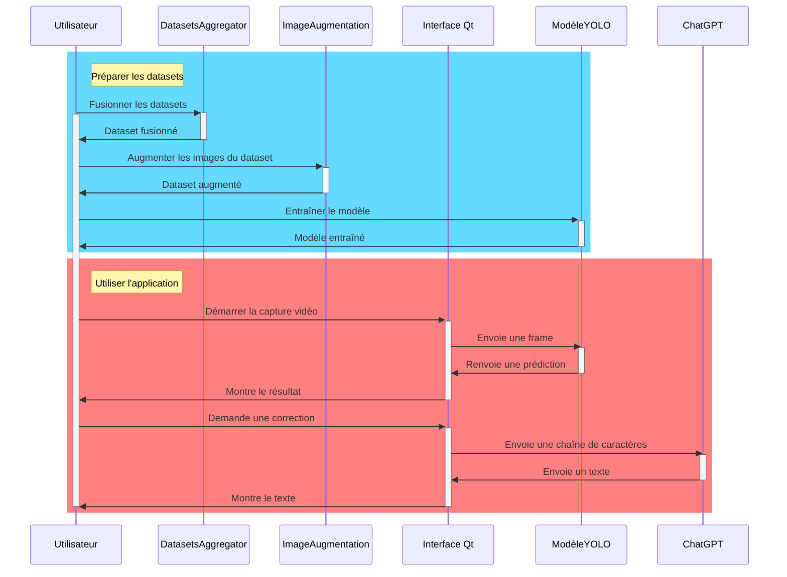

\pagebreak

## Résultats

### Outils de tests

Nous avons réalisé nos tests utilisant deux types de flux vidéos :

- Un flux vidéo enregistré, à partir de la vidéo Youtube [Train YOLOv8 on Custom Dataset | Sign Language Alphabets Detection and Recognition using YOLOv8](https://www.youtube.com/watch?v=-UoSr9Z_Bg0)
- Un flux vidéo en direct, à partir de la *webcam* de l'ordinateur

### Résultats de l'entraînement des modèles

#### Premier modèle : dataset initial ([Sign Language Dataset for YOLOv7](https://www.kaggle.com/datasets/daskoushik/sign-language-dataset-for-yolov7))

| Nombre d'images d'entraînement | Nomre d'epochs entraînés | Temps d'entraînement approximatif |
|--------------------------------|--------------------------|-----------------------------------|
| 1512                           | 5 * 10                   | 30 min                                |

##### Matrice de confusion
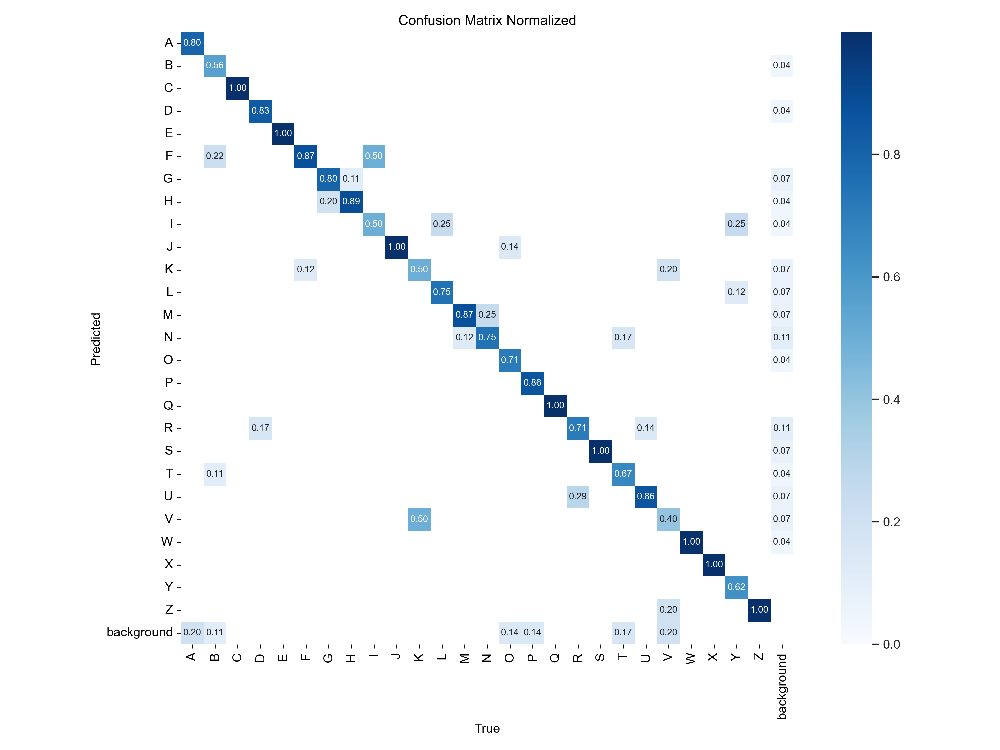

Ce tout premier modèle nous semblait bon, car la matrice de confusion est vraiment encourageante. En réalité, comme celle-ci est normalisée, nous avons des valeurs calculées sur très peu de données.

Les métriques de loss et precision sont déjà plus mitigées : 

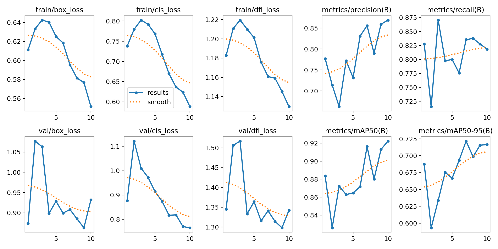

Pour rappel : on cherche à minimiser les courbes de pertes (loss) et à maximiser les courbes de precision, recall et mAP (precision-rappel moyen)

Ici on peut voir que les résultats sont assez médiocres, avec des courbes qui suivent effectivement les résultats espérés vers la fin de l'entraînement, mais qui ne convergent pas assez pour assurer un bon apprentissage.

Cela s'est effectivement fait ressentir lorsque nous faisions nos propres tests : le modèle ne trouvait pratiquement aucune lettre

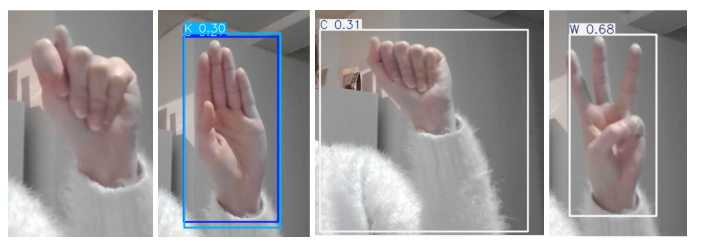

Dans le premier cas il n'y a aucune detection (la lettre signée est un T)

La deuxieme image est un B, mais on peut voir que le modèle détecte un K ou un U

La troisième image la lettre signée est un A mais un C est détecté, avec une boîte englobante inadaptée

La dernière image est un exemple d'une lettre correcte : le W

D'une manière générale, notre modèle trouve uniquement quelques lettres qu'il va prédire sur beaucoup de signes, comme l'exemple de la lettre K :

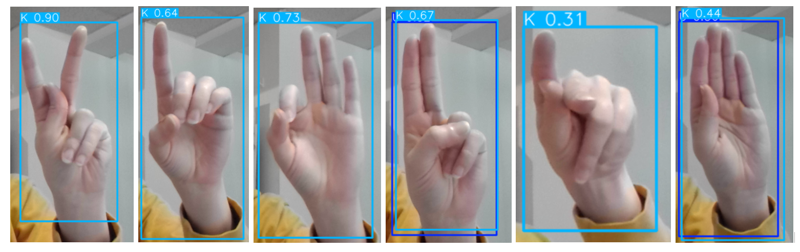

Toutes les prédictions sont de K ou un peu de U 

Pour référence, les lettres signées ici sont dans l'ordre : K - D - F - U - P - B 

#### Deuxième modèle : ajout du dataset [American Sign Language](https://www.kaggle.com/datasets/kapillondhe/american-sign-language) entier

Notre hypothèse sur les performances mauvaises de notre premier modèle était que nous n'avions pas assez d'images dans notre dataset. Pour y remédier nous avons trouvé ce dataset, bien plus fourni. 

| Nombre d'images d'entraînement | Nomre d'epochs entraînés | Temps d'entraînement approximatif |
|--------------------------------|--------------------------|-----------------------------------|
| env 166 000                    | 10                       | 3h                                |

##### Matrice de confusion
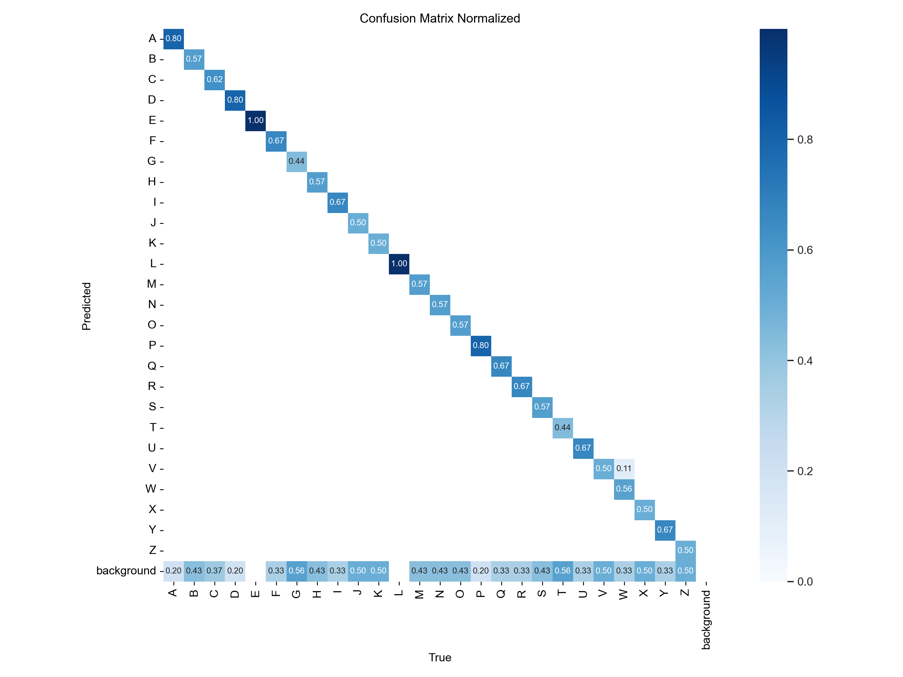

Ici, la matrice de confusion semblait plus réaliste, mais tout de même très bonne pour un entraînement si petit (nous avons commencé avec 10 epochs)

Les courbes de pertes nous montraient en revanche déjà les problèmes que nous pourrions avoir : 


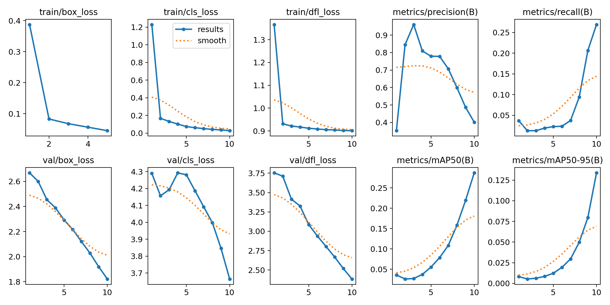

On voit clairement que les courbes de pertes d'entraînement (les 3 en haut à gauche) sont très bonnes : le modèle apprend bien, et les pertes baissent et se stabilisent vers le bas. Notre modèle apprend peut être un peu vite avec si peu d'epochs, mais avec autant d'images ça reste assez plausible.

En revanche, c'est une autre histoire pour les courbes de pertes de validation (les 3 en bas à gauche) qui nous montrent des résultats bien moins intéressants. En effet, notre modèle surapprend totalement sur les nouvelles images, et les images du premier dataset viennent baisser les métriques.

On le voit particulièrement bien ici : 


Les images du nouveau dataset sont toutes très bien predites, mais le modèle ne trouve rien du tout sur celles de l'ancien (les 3 premières), sur-apprennant totalement sur le nouveau modèle ajouté. 

En effet ce dernier comporte des images certes nombreuses, mais bien trop similaires entre-elles (certainement juste un copié-collé pour la majorité) rendant ce dataset très peu intéressant : le modèle surapprend sur le peu de cas compris dans le set, et n'est plus du tout capable de généraliser pour d'autres situations.


#### Troisième modèle : ajout du dataset [ASLYset](https://data.mendeley.com/datasets/xs6mvhx6rh/1) et réduction du nombre d'images de  [American Sign Language](https://www.kaggle.com/datasets/kapillondhe/american-sign-language) 

Ce modèle a été le premier modèle a avoir des résultats exploitables. Nous avons appris de nos erreurs et cherché un dataset plus équilibré. 

| Nombre d'images d'entraînement | Nomre d'epochs entraînés | Temps d'entraînement approximatif |
|--------------------------------|--------------------------|-----------------------------------|
| 5 639                          | 3*50                   | 2h                                |

##### Matrice de confusion
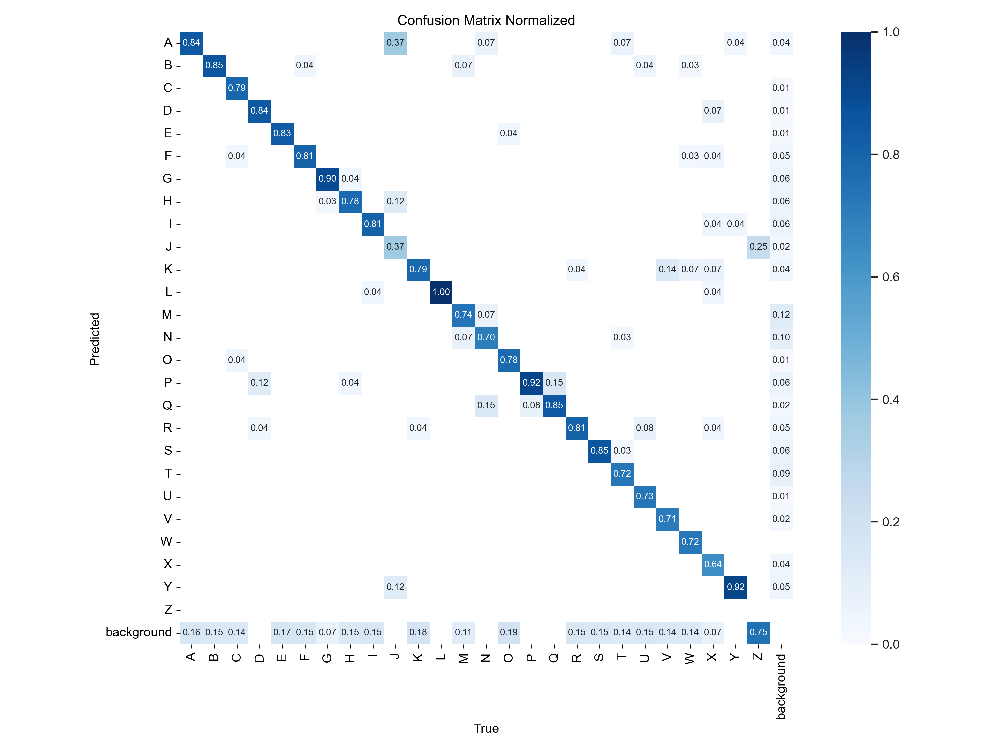

La matrice de confusion est globalement très bonne, avec tout de même encore une certaine difficulté à trouver une lettre (beaucoup sont en "background")

Les métriques de loss et precision sont également très correctes : 

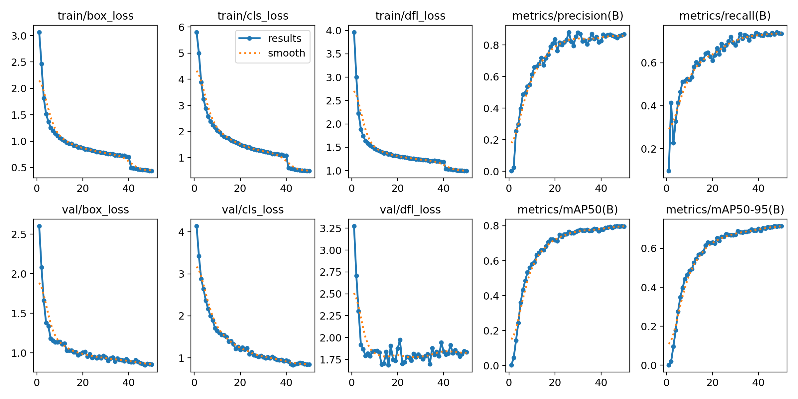

Les tendances sont ce que nous cherchons, avec quelques "tremblements" sur la fin, mais tout de même très correctes. Le modèle ne semble pas sur-apprendre, à voir maintenant avec un test en situation réelle.

Si nous reprenons les mêmes signes testés pour le premier modèle nous obtenons à présent ceci : 

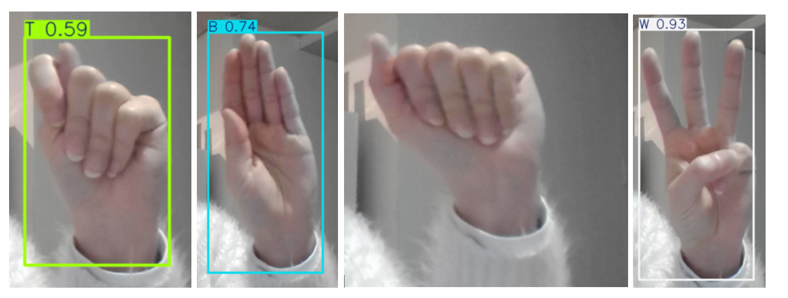

Le premier signe est un T. On peut voir que le modèle le prédit bien, mais l'intervalle de confiance est assez faible. Il m'a fallu un peu de temps pour que le modèle detecte la lettre. 

La deuxième image est un B, également bien trouvé par le modèle, et avec une plus grande confiance

Pour la troisième, un A, rien n'est detecté : on est dans le cas du "background"

Le dernier, une lettre simple à trouver (le W) le modèle y arrive très bien et avec une bonne confiance.

Ces résultats sont donc très corrects et prometteurs, mais pas encore parfaits. Plutôt que de chercher encore un dataset, nous avons cette fois choisi de nous tourner vers l'augmentation de données.

#### Quatrième modèle : augmentation des données de notre dataset composé

| Nombre d'images d'entraînement | Nomre d'epochs entraînés | Temps d'entraînement approximatif |
|--------------------------------|--------------------------|-----------------------------------|
| 11 278                          | 2*100                   | 4h                                |

##### Matrice de confusion
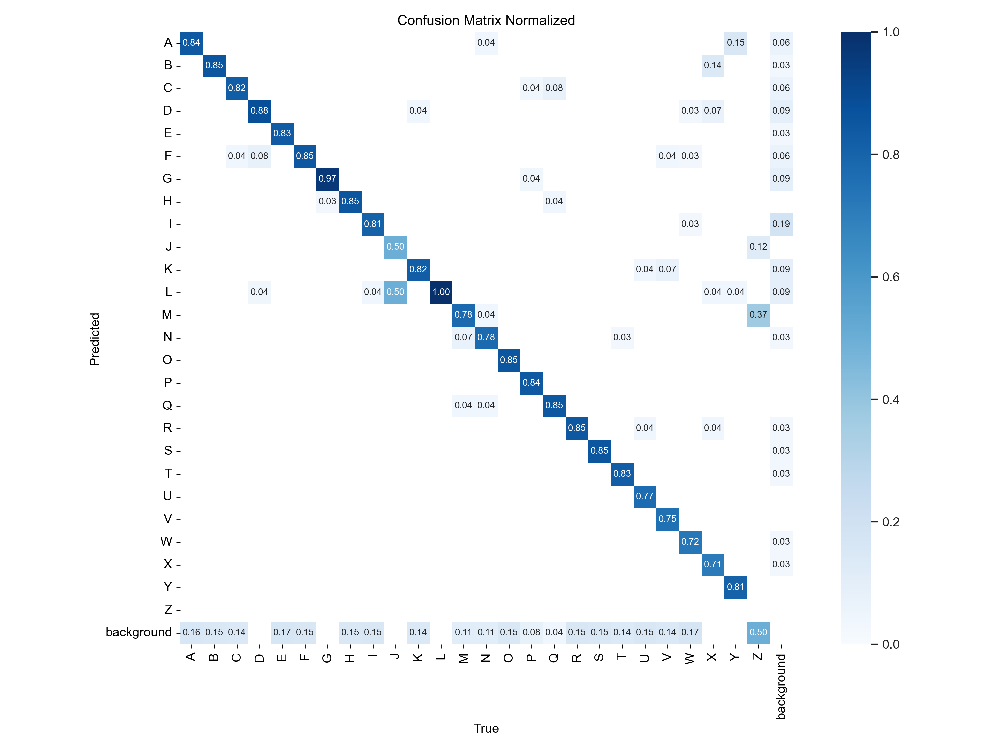

Ici aussi, la matrice de confusion est globalement très bonne, avec toujours la même petite difficulté à trouver une lettre (cas du "background")

Les métriques de loss et precision sont moins belles qu'avant : 

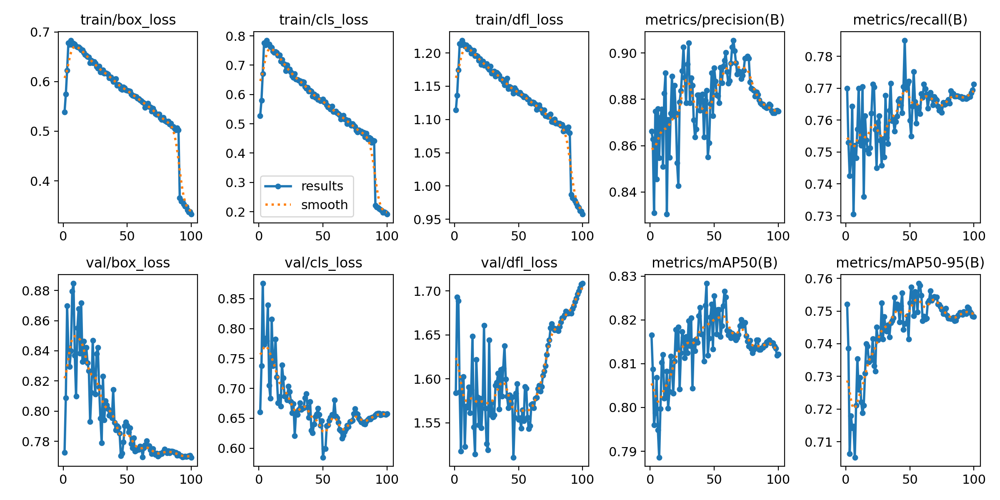

Entraînement comme validation semble s'être empiré entre ce modèle et le précédent. C'est cohérent dans le cadre d'augmentation de données : le modèle généralise plus, donnant donc souvent des résultats moins bons lors de l'entraînement. Comme les données de validation proviennent des même datasets, elles sont aussi moins bien trouvées par le modèle. 

En revanche, les signes sont beaucoup mieux perçus en situation réelle !

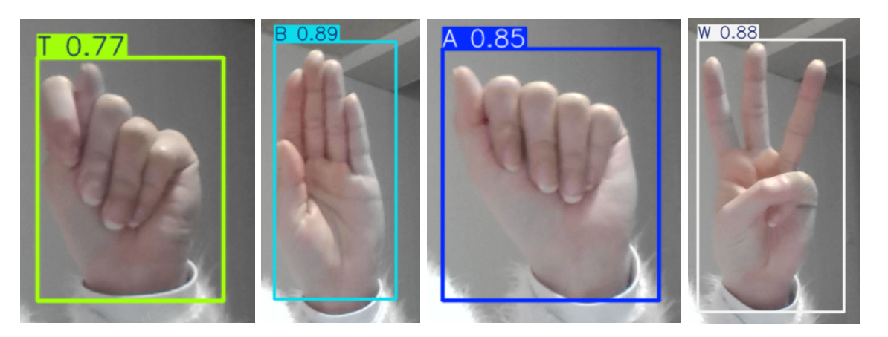

Tous les signes sont correctement trouvés, et à présent toutes les lettres de l'alphabet peuvent être détectées. Certaines necessitent parfois un peu de temps au modèle, mais il finit par y arriver (particulièrement difficile pour les lettres "J" et "Z" pour lesquelles le modèle a eu peu d'exemples, car le geste est normalement signé avec du mouvement)

Les résultats sont donc vraiment bons avec ce modèle.

#### Cinquième modèle : ajout du dataset [Face Detection Dataset](https://www.kaggle.com/datasets/freak2209/face-data) et de la classe "face" (également augmentées)

Ce dernier modèle est très similaire au précédent, nous avons seulement rajouté une classe de détection supplémentaire : le visage (mise en anglais "face" dans le modèle pour garder la cohérence de la détection de la langue des signes anglaise)

| Nombre d'images d'entraînement | Nomre d'epochs entraînés | Temps d'entraînement approximatif |
|--------------------------------|--------------------------|-----------------------------------|
| 12 218                          | 200                   | 5h                                |

##### Matrice de confusion
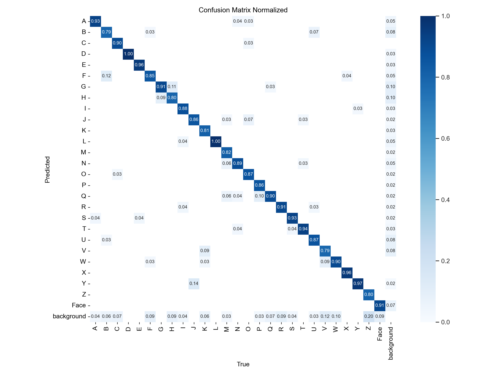

Ici aussi, la matrice de confusion est globalement très bonne, avec toujours la même petite difficulté à trouver une lettre (cas du "background") On voit la nouvelle classe "face" qui est globalement bien detectée. 
L'entraînement a été recommencé de zero (from scratch) pour pouvoir observer les différentes améliorations en partant toujours du même point de départ. Une version partant du modèle précédent (en transfert learning) aurait également été envisageable, à condition de bien garder toutes les images de notre set pour que le modèle n'"oublie" pas ce qu'il a appris avant.

Les métriques de loss et precision sont très belles sur nos 200 epochs : 

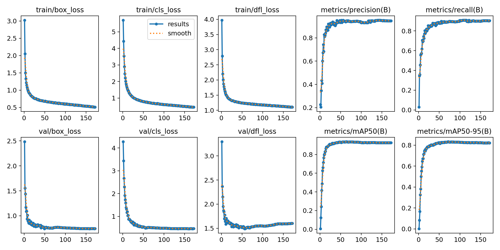

La perte suit une belle courbe vers le bas, convergeant vers 0. La precision, le recall et le mAP sont très haut, près de 0,8 ou au-dessus. Ce sont donc des valeurs encourageante et qui devraient nous donner un modèle efficace. 

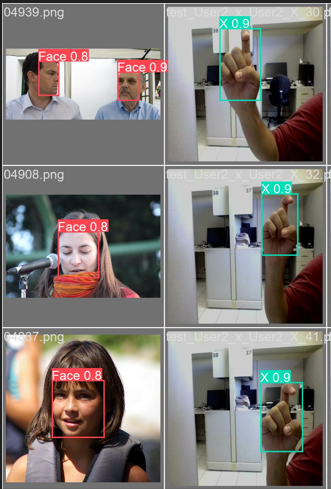

Cette image est un échantillon du batch de validation du modèle. On voit que les visages sont bien detectés. 

Dans notre repertoire GitHub, ce modèle est celui utilisé par défaut, et il est présent dans le dossier "models/train_200_face_augmented".

\pagebreak

## Conclusion

Dans ce projet, nous avons réussi à mettre en place un modèle de détection d'objets capable de reconnaître des signes en
langue des signes américaine en temps réel. Nous avons entraîné ce modèle sur un *dataset* de lettres en langue des signes,
et avons obtenu des résultats satisfaisants. Notre application est capable de détecter et de classer des signes en temps 
réel, et peut être utilisée via une *webcam* ou sur des vidéos préenregistrées.

Ce projet nous a montré l'importance du *dataset* dans la qualité des résultats d'un modèle de détection d'objets. Nous 
avons rencontré des difficultés, qui se sont avérées être liées à la qualité et la diversité de notre dataset. Nous avons
dû augmenter sa taille et ses images (manipulations sur les images) pour obtenir des résultats satisfaisants, en conservant 
les informations de *bounding boxes*.

Cette application avait une visée de démonstrateur, et se borne donc à reconnaître des lettres. Dans un contexte réel, 
les mains sont constamment en mouvement, une première piste d'amélioration que nous pourrions explorer serait de trouver 
un moyen de détecter les lettres qui nécessitent un mouvement comme le "J" ou le "Z". De plus, une discussion en langue 
des signes implique de signer de nombreux mots, à peu près autant qu'en langue vocale, et nécessiterait un modèle beaucoup 
plus complexe, capable de reconnaître un grand nombre de signes différents, avec un temps d'entraînement d'autant 
conséquent. Ce serait une autre piste d'amélioration découlant de la première, qui serait possible en étendant le 
*dataset* et en entraînant le modèle sur un plus grand nombre de signes.

\pagebreak

## Références

Nous avons regardé de nombreux projets existants pour nous inspirer et comprendre les difficultés que nous allions rencontrer. Voici quelques-uns des projets que nous avons consultés.

Avec RetinaNet, que nous avons fini par ne pas utiliser :

- [Video Object Detection with RetinaNet](https://freedium.cfd/https://medium.com/@findalexli/object-detection-object-detection-is-an-important-task-in-the-field-of-computer-vision-research-63fdcc006fb1)
- [`nwojke / deep_sort`](https://github.com/nwojke/deep_sort)
- [Object-Detection: Advanced Object Detection with RetinaNet](https://medium.com/@vipas.ai/object-detection-advanced-object-detection-with-retinanet-a326c92a2e34)
- [`jaspereb / Retinanet-Tutorial`](https://github.com/jaspereb/Retinanet-Tutorial)

Avec YOLO, que nous avons finalement utilisé :

- [`MuhammadMoinFaisal / Sign-Language-Alphabets-Detection-and-Recongition-using-YOLOv8`](https://github.com/MuhammadMoinFaisal/Sign-Language-Alphabets-Detection-and-Recongition-using-YOLOv8?tab=readme-ov-file)
- [`mukund0502 / sign_recognition_yolo-v8`](https://github.com/mukund0502/sign_recognition_yolo-v8/tree/main)
- [`paulinamoskwa / Real-Time-Sign-Language`](https://github.com/paulinamoskwa/Real-Time-Sign-Language?tab=readme-ov-file)
